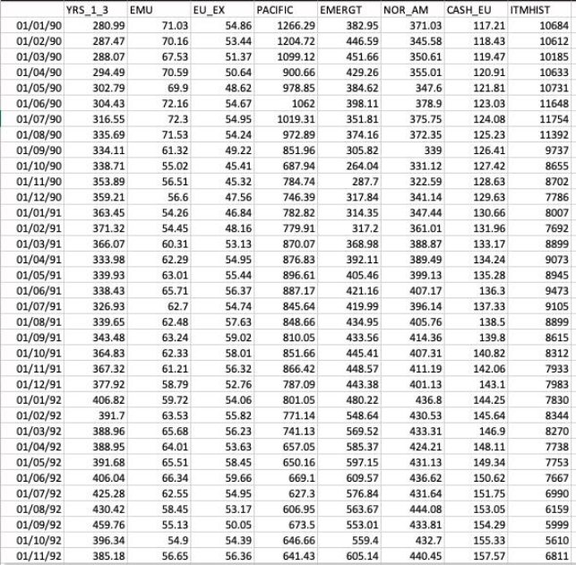
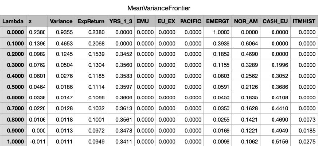

CL-643 Project Report

**Portfolio-Optimization** 

**The Problem:** 

One of the classic problem of stock market is how to construct an investment portfolio that maximises returns while managing risks. This involves in selecting a combination of assets (stocks, bonds, currencies, etc) that provides the best tradeoff between risk and returns. Since the future returns of securities are unknown at the time of the investment decision is made, portfolio selection problem can be categorised as one of the decision- making under risk.

Our approach to addressing the problem involves the initial step of formulating a comprehensive mathematical model, incorporating constraints and enhancing the objective function. Subsequently, we design a model for solving this mathematical formulation using Metaheuristic techniques and Mathematical programming. Finally, we provide real life dataset to test it.

**Mathematical Formulation:** 

Following are symbolic representation of some general terms

- n = Number of Assets in Portfolio
- ri = Expected Returns of asset i
- wi = Weight(Allocation) of asset i in portfolio.**(Decision Variable)**
- Cov( ri, rj ) = Covariance between returns of asset i and j.
- rp  = Expected Return of Portfolio
- σp = Standard Deviation of Portfolio (Risk)
- λ = Risk Aversion Parameter

Our goal is to maximise the expected return of portfolio within the targeted risk. This can be expressed as

**Maximize: rp = Σ(wi \* ri) (i=1 to n)** 

Subject to,

**Budget Constraint**: The sum of the weights should equal 1 to represent a fully invested portfolio.

**Σw\_i = 1 (i=1 to n)** 

**Risk Constraint:** Control the portfolio's risk (variance) by setting an acceptable level of risk, often measured as portfolio standard deviation (σp). This constraint ensures that the portfolio risk is within an acceptable range.

**σp ≤ σtarget**

**Asset Allocation Constraint:** This is basically the lower bounds and upper bounds to the weights.

**wmin ≤ wi ≤ wmax** (i=1 to n) **Mean Variance Optimisation** 

The above optimization problem can be extended to consider the trade-off between risk and return using a risk-aversion parameter (λ). The objective then becomes to maximize the utility function U, which combines the expected return and risk (variance) with a risk-aversion parameter.

**Maximise U = rp\*(1-λ) - λ\* σp** 

This formulation allows you to find the optimal portfolio weights (w\_i) that balance the trade-off between risk and return according to the investor's risk preference (λ). A higher λ means the investor is more risk-averse, and the portfolio will be tilted towards lower-risk assets.

**Note:**  

Daily Returns = (ClosingPricecurrentday - ClosingPriceprevday)/ClosingPricecurday Standard Deviation = sqrt( weight \* covariance\_matrix \* weight’ )

**The Data** 

Data provides us information on Closing Prices of all assets using which we calculate daily/monthly or quarterly return, expected Return and Variance- Covariance Matrix.

Example Data:

The above is the monthly closing price for 7 different assets.

We use real data for the 10-year period 1990-01-01 to 2000-01-01. Data cover:

`      `23 Italian Stock indices

`      `3 Italian Bond indices (1-3yr, 3-7yr, 5-7yr)

`      `7 international Govt. bond indices

`      `5 Regions Stock Indices: (EMU, Eur-ex-emu, PACIF, EMER, NORAM)

`      `US Corporate Bond Sector Indices (Finance, Energy, Life Ins.)

`      `Exchange rates, ITL to: (FRF, DEM, ESP, GBP, US, YEN, EUR)       Also US to EUR.

This was readily available data in .gdx (GAMS data exchange) form Source: [Click Here](https://www.gams.com/latest/finlib_ml/libhtml/finlib_Estimate.html)

**Results** 

1. **Metaheuristic Techniques** 

Solution Model for Metaheuristic Techniques was coded in Matlab using subset of above dataset of about 8 decision variables.

**Algorithm Used:** 

- TLBO
- DE
- PSO

**Parameters:** 

- Number of Iterations: 1000
- Populations Size: 50
- Pc: 0.8 and F:0.5 (For DE)
- W = 0.8, c1 = 1.5 and c2 = 1.5 (For PSO)
- Target Risk = 0.3

**Outcome of Fitness Function** 

|**TLBO**|0\.1439|
| - | - |
|**DE**|0\.1444|
|**PSO**|No Feasible Solution|

2. **Mathematical Programming** 

Solution model for mathematical programming was developed on GAMS using same subset of above data and also implemented mean-variance optimisation.

**Solver Used:** Used NLP (i.e, non linear programming) since standard deviation equation which is risk term in not linear.

**Outcomes:** 

Here we get range of outcomes by varying value of “λ” and if you see 3rd row and compare it with the outcomes of Metaheuristic techniques you will find a clear winner.

3. **Better Approach:** 

Since the problem is non-linear for very large data set you should start with Metaheuristic approach and the solution of this will provide us starting points for mathematical programming. This will give us best possible solution.

**Application in Industry** 

As coming generations enhance their financial literacy, their inclination to invest in assets that are both secure and lucrative has grown. This trend has led many individuals to explore stocks and opt for **mutual funds**.

A mutual fund, overseen by a proficient Fund Manager, functions as a collective investment trust that pools funds from a multitude of investors sharing a common investment objective. The amassed capital is then strategically allocated across a diversified portfolio, encompassing equities, bonds, money market instruments, and various other securities.

This rise in interest have constantly elevated the demand for portfolio management and optimization. As a result, there is a great focus on research and development to devise improved approaches that takes real-life constraints into account.

**Current Industry Approaches** 

There are many new mathematical formations which also looks into real life constraint such as transaction costs, management expenses. There are many new algorithm which solves complex business model using **Stochastic Programming.** Algorithms using **Fuzzy-logic** and **Neural Networks (ANN)** are also being devised.

Sources: 

1. [https://citeseerx.ist.psu.edu/document? repid=rep1&type=pdf&doi=dc376e785b58a68cbc5cbe8e4baef6a4ad440 c80](https://citeseerx.ist.psu.edu/document?repid=rep1&type=pdf&doi=dc376e785b58a68cbc5cbe8e4baef6a4ad440c80)(Series of papers were referred from this)
1. <https://www.sciencedirect.com/science/article/pii/S2214716019300399>
